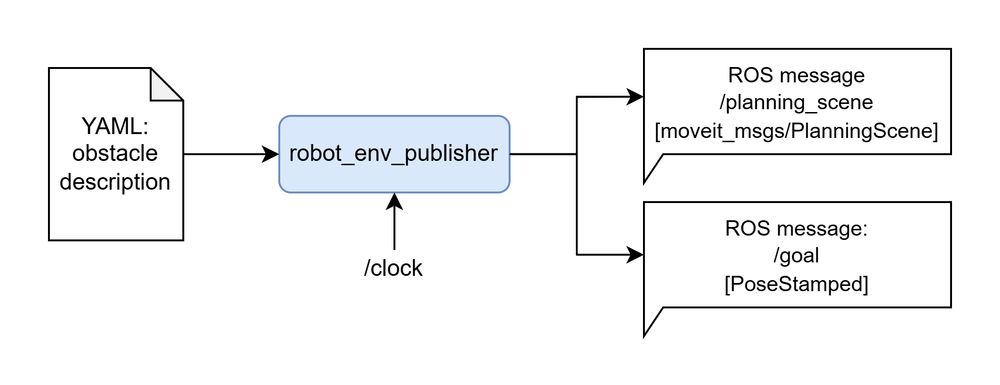

# robot_env_publisher

Reads in the YAML in a specific format and publish the obstacle environment message [`moveit_msgs/PlanningScene`](http://docs.ros.org/en/noetic/api/moveit_msgs/html/msg/PlanningScene.html) according to the time.



## Installation

### In ROS workspace

It is suggested to install this package from the whole example repository [FLIQC_example_workspace_ros](https://github.com/hwyao/FLIQC_example_workspace_ros), which contains all the submodule for this repository.

If you really want to install this package individually:
1.  clone this repository into a catkin workspace:
    ```bash
    cd <your_catkin_workspace>/src
    git clone https://github.com/hwyao/robot_env_publisher
    ```

2.  install the dependencies in `src` folder with [rosdep](https://wiki.ros.org/rosdep): `rosdep install --from-paths . --ignore-src -r -y`.
   If you have not installed `rosdep`, you can do install and initialize it with:
```bash
sudo apt-get install python3-rosdep
sudo rosdep init
rosdep update
```

3.  build the package: `catkin build`

## Running this package

Ther are several launch scripts provided in this package, which can be used to run the publisher differently. The scene file should be in `scene` folder, so that the planner can search the corresponding name. There are several extra parameters: `frequency`, `enable_marker_visualization`. Please refer to the launch files for more details.

### Publish the message

This is a example process of how others can use this package to publish the environment scene message. If you want to just visualize the environment scene, you can see the later sections.

```bash
rosparam set /use_sim_time true

# First terminal, it will stop and wait for the user input for clock time
roslaunch robot_env_publisher file_env_node.launch env_scene:=<FILE_NAME> 

# Second terminal, it will publish the clock time, or replace it with your clock source
rosrun robot_env_publisher publish_clock.py
```

After starting the above script, the interested topics are:
- '/planning_scene' [`moveit_msgs/PlanningScene`](http://docs.ros.org/en/noetic/api/moveit_msgs/html/msg/PlanningScene.html): the pose data is in `planning_scene.world.collision_objects.primitive_poses`, and the type is in `planning_scene.world.collision_objects.primitives`.
- '/goal' [`geometry_msgs/PoseStamped`](http://docs.ros.org/en/noetic/api/geometry_msgs/html/msg/PoseStamped.html)

You can listen to these topics with other nodes for your planning application.

### Publish and visualize

```bash
roslaunch robot_env_publisher check_env_scene.launch env_scene:=<FILE_NAME>
```


### Publish and visualize with controlling the time

This will pop up a slidebar to control the time, which is useful for quickly checking the environment scene under different time. Don't use the mouse to drag since the dynamic_reconfigure only make callback when the mouse is released. Instead, You click and focus on the slidebar, then use the '<-' and '->' keys to control the time.

```bash
roslaunch robot_env_publisher check_env_scene_slidebar.launch env_scene:=<FILE_NAME>
```


## YAML definition

The YAML file example is like:

```yaml
initial_configuration: 
  panda: [0.0, -0.785398163, 0.0, -2.35619449, 0.0, 1.57079632679, 0.785398163397]
goal: 
  position: [0.3, 0.3, 0.5]
  orientation: [0.0, 0.0, 0.0, 1.0]
obstacles:
  - name: "Obstacle1"
    description:
      type: "SPHERE"
      dimensions: [0.05]
    position: [0.25, 0.5, 0.7]
    orientation: [0.0, 0.0, 0.0, 1.0]
    velocity_w: [0.0, 0.0, 0.2]
    velocity_v: [0.0, 0.02, 0.0]
    use_velocity_as_twist: true
  - name: "Obstacle2"
    description:
      type: "SPHERE"
      dimensions: [0.05]
    position: [-0.15, 0.18, 0.6]
    orientation: [0.0, 0.0, 0.0, 1.0]
    velocity_w: [0.0, 0.0, 0.3]
    velocity_v: [0.0, 0.03, 0.0]
    use_velocity_as_twist: true
```

Field explanation:
- `initial_configuration`: the initial configuration of the robot, a list of joint angles. Will be injected into the gazebo parameter.
- `goal`: the goal position and orientation of the robot, which will be published to the topic `/goal`.
- `obstacles`: a list of obstacles, each obstacle has the following fields:
  - `name`: the name of the obstacle, just randomly assigned.
  - `description`: the description of the obstacle, which contains:
    - `type`: the type of the obstacle
      - support "BOX", "SPHERE", "CYLINDER", "CONE".
    - `dimensions`: the dimensions of the obstacle, a list of floats. 
      - For "BOX", it is [x, y, z].
      - For "SPHERE", it is [radius].
      - For "CYLINDER", it is [radius, height].
      - For "CONE", it is [radius, height].
    - NOTE: the above definitions are the same as [`moveit_msgs/SolidPrimitive`](https://docs.ros.org/en/noetic/api/shape_msgs/html/msg/SolidPrimitive.html).
  - `position`: the starting position of the obstacle, a list of floats [x, y, z].
  - `orientation`: the starting orientation of the obstacle, a list of floats [x, y, z, w], which is a quaternion.
  - `velocity_w`: the angular velocity of the obstacle, a list of floats [x, y, z], this will be used to update the pose of the obstacle.
  - `velocity_v`: the linear velocity of the obstacle, a list of floats [x, y, z], this will be used to update the pose of the obstacle.
  - `use_velocity_as_twist`: a boolean value, if true, the velocity_w and velocity_v will be used as the twist of the obstacle (Then object will do a screw motion). If false, the velocity_w and velocity_v will be used to update the position of the obstacle directly (Then object will do a linear motion with rotation)
